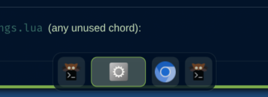
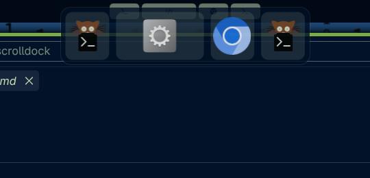

# Scroll Dock

A **dock** for the Hyprland **scrolling layout** — every window on your
active workspace drawn as a tile shaped like the real window, living in its
own corner of the screen instead of inside the bar. Click a tile to jump to
that window; right-click the dock itself to change how it looks.

Same underlying idea as [Scroll Map](https://github.com/jgarza9788/scrollmap)
(same author) — a proportional, click-to-focus map of your windows — just as
its own floating element instead of something that lives in the bar.



*If Scroll Dock is useful to you, consider [buying me a coffee](https://buymeacoffee.com/jgarza97885).*

## What you get

- **A real dock, not a bar widget** — its own floating panel, anchored to
  whichever screen edge you want, that sits on top of your windows instead of
  squeezing into the bar.
- **Tiles shaped like their windows** — a square window draws roughly
  square, a wide window draws wide, a tall narrow window draws narrow. The
  dock's thickness never changes; only each tile's length does.
- **Three sizes and adjustable opacity** — from a right-click settings panel,
  no config file required for the everyday choices.
- **Six workspace-switch transitions** — fade, blur, zoom, slide, a
  glitchy RGB-split, or none, played whenever you switch workspaces.
- **Auto-hide** that collapses to a sliver flush against the true screen edge
  (no dead zone to cross) and reveals the full dock on hover.
- **A hover effect** — tiles magnify near the cursor like a real dock, or
  just lift and brighten, or neither.
- Built entirely on Omarchy Shell / Quickshell APIs — no daemons, no
  compositor plugin, no `hyprpm`.



Outside the scrolling layout the dock just says `only for scrollable layout`
and does nothing else — it has nothing meaningful to show.

## Install

```sh
omarchy plugin add https://github.com/jgarza9788/omarchy-scrolldock.git --enable
```

or clone into `~/.config/omarchy/plugins/jgarza.scrolldock` and run
`omarchy-shell shell rescanPlugins`.

The dock shows up immediately — no keybind required to see it — but you'll
probably want one to hide/show it on demand:

```lua
-- ~/.config/hypr/bindings.lua (any unused chord)
o.bind(
  "SUPER + D",
  "Toggle scroll dock",
  "omarchy-shell shell toggle jgarza.scrolldock '{}'"
)
```

## Settings panel

**Right-click anywhere on the dock's background** (not on a window tile —
that still focuses the window) to open it:

| Control | Choices |
|---|---|
| Size | `small` / `medium` / `large` |
| Opacity | 10–100% |
| Edge | `top` / `bottom` / `left` / `right` |
| Monitor | `all`, or one connected monitor's name |
| Hover effect | `magnify` / `lift` / `none` |
| Tile label | `icons` / `nerdfont` / `none` |
| Workspace-switch transition | `fade` / `blur` / `zoom` / `slide` / `glitch` / `none` |
| Auto-hide | on/off |
| Show floating windows | on/off |
| Dim unfocused windows | on/off |
| Animate changes | on/off |

Every control changes the running dock immediately and persists into
`shell.json`, so hand-editing the file and using the panel stay in sync.
Click outside the card, press `Esc`, or hit the ✕ to close it. Finer-grained
numeric knobs (gaps, magnify strength, auto-hide timing, …) are deliberately
left out of the panel to keep it short — set those directly in `shell.json`
(next section).

## How it behaves

- **Scope** — one dock per connected monitor, each showing that monitor's own
  active workspace (restrict to a single monitor with `monitor`).
- **Position** — anchored to one screen edge, centered along it, floating
  over windows rather than reserving space (it won't shove your tiled windows
  over).
- **Shape** — the dock's thickness never changes per-tile; a tile's *length*
  is derived from the real window's own aspect ratio against that fixed
  thickness — down to a small floor (`minCell`, low by default) so a narrow
  sliver of a window doesn't disappear entirely. If every tile's natural
  length together would run past `maxLength`, every tile shrinks by the same
  factor so the dock still fits on screen.
- **Workspace-switch transition** — `transitionEffect` plays a short effect
  over the dock whenever *this monitor's active workspace changes* (not on
  every window open/close/move): `fade` (cross-fade in, the default), `blur`
  (a real Qt `MultiEffect` blur that resolves to sharp, eased like a sine
  wave), `zoom` (scales in from slightly smaller), `slide` (slides + fades in
  from whichever side matches the direction you switched), `glitch` (a red
  ghost and a blue ghost of the tiles fly apart to either side and snap back
  together over the sharp tiles), or `none`. The tile swap itself is always
  instant — these just mask the jump-cut with a short animation
  (`transitionMs`).
- **Hover effect** — `magnify` grows tiles near the cursor, strongest right
  under it, falling off over `magnifyRadius` px (contained within the dock's
  own bounds rather than popping up above it, unlike a real macOS dock, to
  keep the implementation simple); `lift` is a flat scale + brighten.
- **Floating windows** — shown by default (`showFloating`), slotted in by
  position with a dashed outline, since a dock is meant to represent
  everything on the desktop rather than just the tiled columns.
- **Hide** — both ways: `omarchy-shell shell toggle jgarza.scrolldock '{}'`
  shows/hides the whole dock, and independently, `autoHide` collapses it to a
  thin sliver that reveals the full dock on hover.
- **Updates** — driven by Hyprland events (open/close/move/float/workspace),
  with a short fast-poll afterwards and a slow safety poll for event-less
  viewport shifts, same as scrollmap.

## Configuration

Settings live in this plugin's object entry in `~/.config/omarchy/shell.json`
(the `plugins` array). Every key is optional and falls back to its default;
the settings panel reads and writes the same entry, so a key it doesn't cover
is exactly as durable as one it does.

```jsonc
"plugins": [
  {
    "id": "jgarza.scrolldock",
    "edge": "bottom",
    "size": "medium",
    "opacity": 0.55,
    "autoHide": true,
    "hoverEffect": "magnify"
  }
]
```

### Set from the settings panel (or by hand)

| Key | Default | Meaning |
|---|---|---|
| `edge` | `"bottom"` | Screen edge the dock is anchored to: `top`, `bottom`, `left`, `right`. |
| `size` | `"medium"` | Dock thickness preset: `small` (28px), `medium` (40px), or `large` (56px). |
| `opacity` | `0.55` | Backdrop alpha, `0.1`-`1`. The settings-panel slider works in whole percent (10–100). |
| `monitor` | `"all"` | Show on every connected monitor, or only the one with this name (`hyprctl monitors` for names). |
| `hoverEffect` | `"magnify"` | `magnify`, `lift`, or `none`. |
| `iconMode` | `"icons"` | What each tile draws: `none`, `icons`, or `nerdfont`. |
| `transitionEffect` | `"fade"` | `fade`, `blur`, `zoom`, `slide`, `glitch`, or `none`. |
| `reserveSpace` | `false` | `false` overlays the dock on top of windows; `true` reserves its thickness as a layer-shell exclusive zone, pushing other windows clear like a taskbar. |
| `autoHide` | `false` | Collapse to a thin edge sliver and reveal on hover. |
| `showFloating` | `true` | Include floating windows, drawn with a dashed outline. |
| `dimInactive` | `true` | Fade every tile except the focused window. |
| `animate` | `true` | Animate tile position/size changes and the reveal/hide transition. |
| `middleClickClose` | `true` | Middle-click a tile closes that window. Disable to leave middle-click a no-op. |

### shell.json-only (no panel control)

| Key | Default | Meaning |
|---|---|---|
| `minCell` | `6` | Smallest a single window tile may shrink to along the dock's length. Kept low so narrow windows draw as narrow tiles; raise it if you'd rather trade shape accuracy for an easier click target. |
| `maxLength` | `900` | Longest the dock may get before it stops growing with more windows. |
| `gap` | `8` | Space between tiles, in px. |
| `margin` | `8` | Gap between the *revealed* dock and the screen edge it's anchored to. Ignored while auto-hidden — the collapsed sliver always sits flush against the true edge. |
| `padding` | `6` | Inner breathing room between the dock's edge and its tiles. |
| `magnifyScale` | `1.35` | Max scale a tile reaches right under the cursor, in `magnify` mode. |
| `magnifyRadius` | `80` | Falloff distance in px for the magnify effect. |
| `transitionMs` | `260` | Duration of the workspace-switch transition effect. |
| `autoHideDelayMs` | `400` | Grace period after the pointer leaves before re-hiding. |
| `revealMs` | `160` | Reveal/hide animation duration. |
| `hotZoneSize` | `4` | Thickness of the sliver left on-screen while auto-hidden. |

Restart the shell (`omarchy restart shell`) after hand-editing `shell.json`.

## Development

```
node tests/model.test.js                     # pure layout-math unit tests
omarchy-plugin-validate .                     # manifest check
omarchy restart shell                         # reload QML (hot-reload is unreliable for overlays)
```

Do **not** run `omarchy refresh shell` while iterating — it resets
`shell.json` to the Omarchy default.

`Model.js` is the same geometry/label math as `jgarza.scrollmap`'s `Model.js`
(a dock tile and a mini-map cell are the same shape problem), plus the
small/medium/large size-preset helpers — ES5 so it runs both in QML and under
Node. `ScrollDock.qml` owns config, live Hyprland state, and the per-key
setters; `DockPanel.qml` is the per-monitor `PanelWindow` (anchoring, auto-hide
reveal, workspace-switch transitions); `DockCell.qml` is one window tile;
`SettingsPanel.qml` is the right-click panel.

## Notes

- Floats over windows (`ExclusionMode.Ignore`) by default rather than
  reserving screen space, so auto-hiding never reflows your other windows.
  Flip `reserveSpace` on (settings panel or shell.json) to reserve the dock's
  thickness as a layer-shell exclusive zone instead — combined with
  `autoHide`, other windows will reflow live as the dock collapses/reveals.
- `blur` and `glitch` both use Qt6's `QtQuick.Effects.MultiEffect` (blur, and
  `colorization` for glitch's red/blue ghosts); every other effect is plain
  `Item`/`Rectangle` property animations.
- The settings panel is built from plain `Rectangle`/`Text`/`MouseArea` plus
  `qs.Ui`'s `Button` (chip rows), `ToggleSwitch` (on/off rows), and
  `PanelSlider` (Opacity) — not `qs.Ui.PopupCard`, which expects a real bar to
  anchor off of.
- Coexists with `jgarza.scrollmap` (bar mini-map) and `jgarza.scroll-overview`
  (zoom-out overview) — they cover different moments: at-a-glance in the bar,
  a dock you can always click, and a full workspace overview.

## License

MIT — see [LICENSE](LICENSE).
